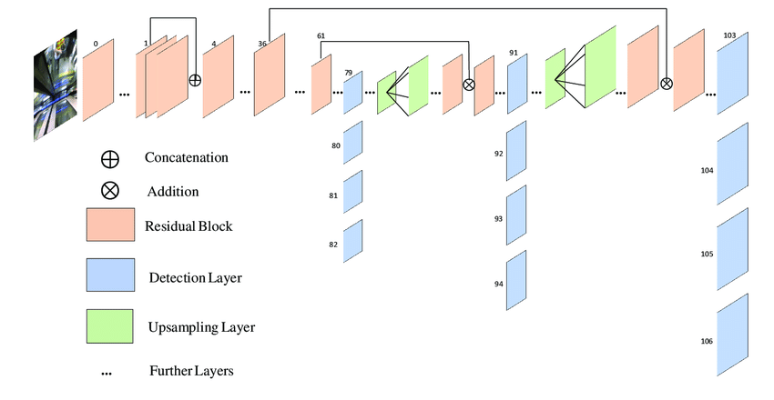
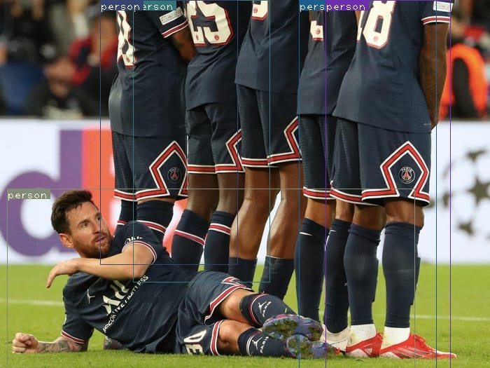

[](https://www.python.org/)
[](https://www.pytorch.org/)

# Yolov3 from scratch  



This is an unofficial pytorch implementation of [yolov3]( https://arxiv.org/abs/1804.02767) for 2-D object detection, Don't forget to checkout the original authors [site](https://pjreddie.com/darknet/yolo/) and [repo](https://github.com/pjreddie/darknet).

**If you want to learn about:**

  -buidling a large model from config files
  
  -nms
  
  -iou
  
  -bboxes
  
  -confidence scores
  
  -some opencv tricks
  
  then you are in the right place , why don't you start expermenting now ? :)

```python
git clone https://github.com/mohamedgamal7/PyYolov3
```
All files are commented and pretty much readable for anyone who wants to try this out.

## Requirements

All dependancies can be installed using the requirements.txt file provided :
```python
pip install -r requirements.txt
```

Download the pretrained weights from the original repo and place it in the main directory :
```
 wget https://pjreddie.com/media/files/yolov3.weights
```
## project aim 
The project aims to depen my understanding of object detection by implementing 
the minute details line by line from scratch which I beleive is the only way to mastery.

Training files are not provided as it  would take so much time on my gtx 1060 but I'm looking forward 
to give it a try on colab. 

## project constructions
The project has four main files :

- model.py where our yolov3 model architecture was built with the help of a cfg file obtained from original repo

- utils.py where helper functions for the detection task like bbox_iou are present 

- detect_images.py file used for obtaining detections on a single image or images in a directory 

- detect_video.py file used for obtaining detections on a video 


 ##  Run video predictions
```python
python detect_video.py --video videoname.mp4 
```
## video predictions output example


 ##  Run image predictions
```python
python detect_images.py --imgs imgDirectoryORsingleImgPath 
```
## Image predictions example



## References
- yolov3 paper https://arxiv.org/abs/1804.02767
- yolov3 repo https://github.com/pjreddie/darknet

